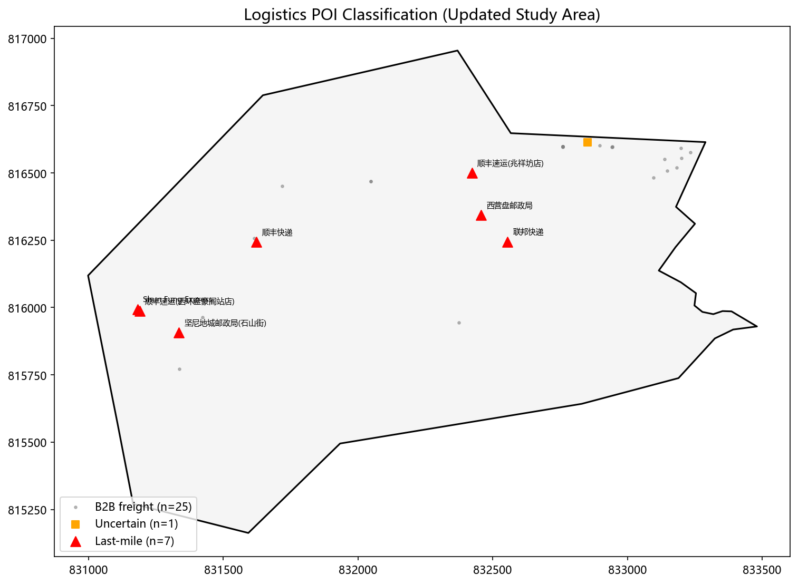
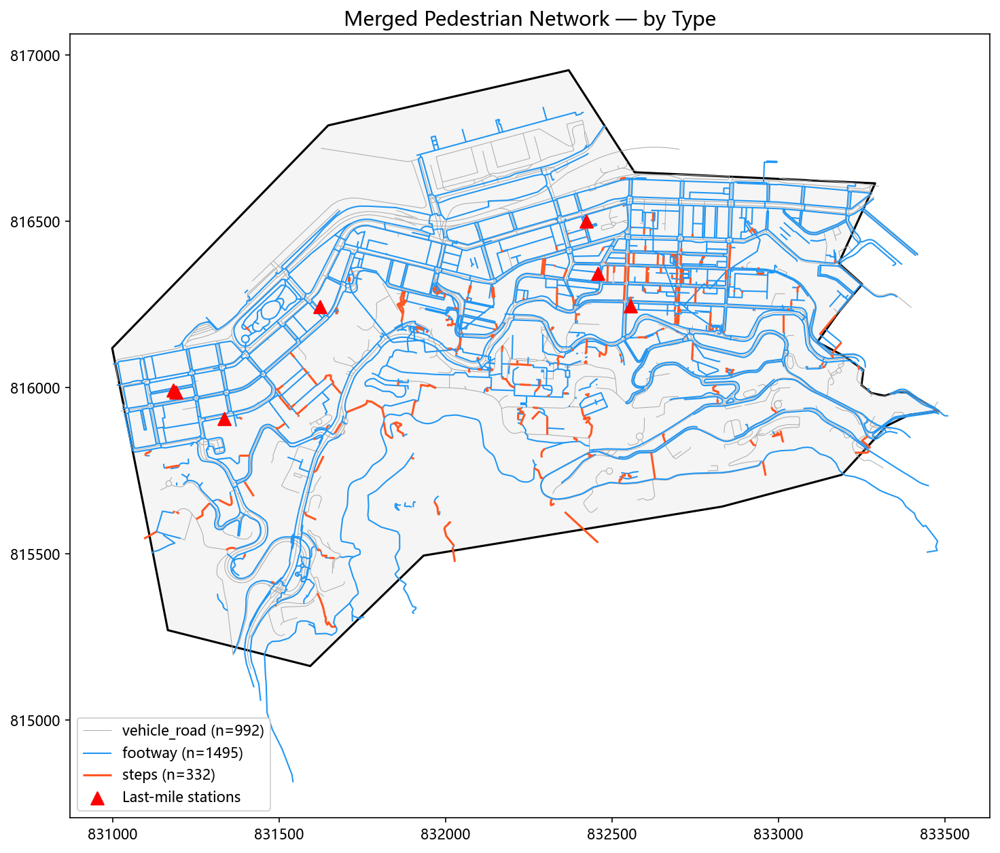
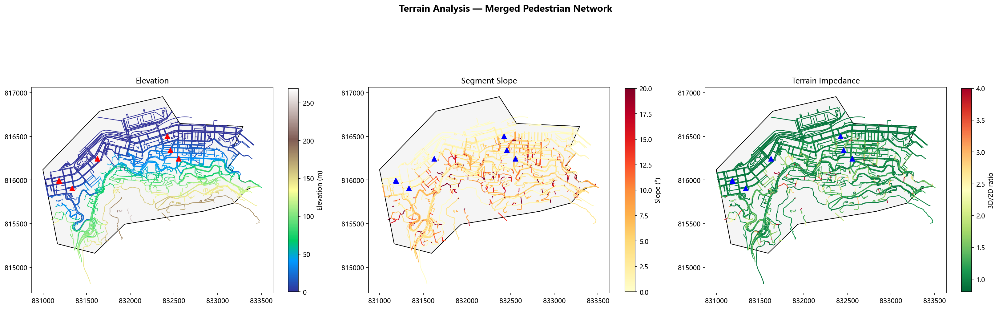
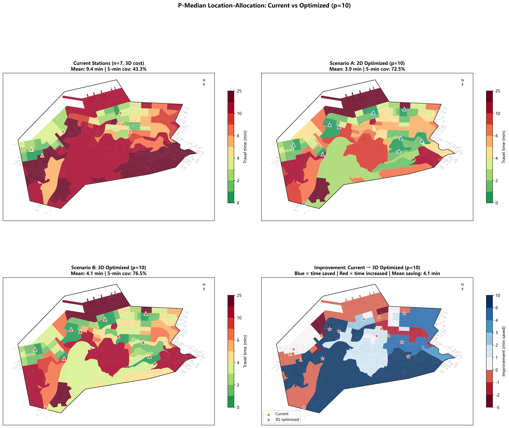
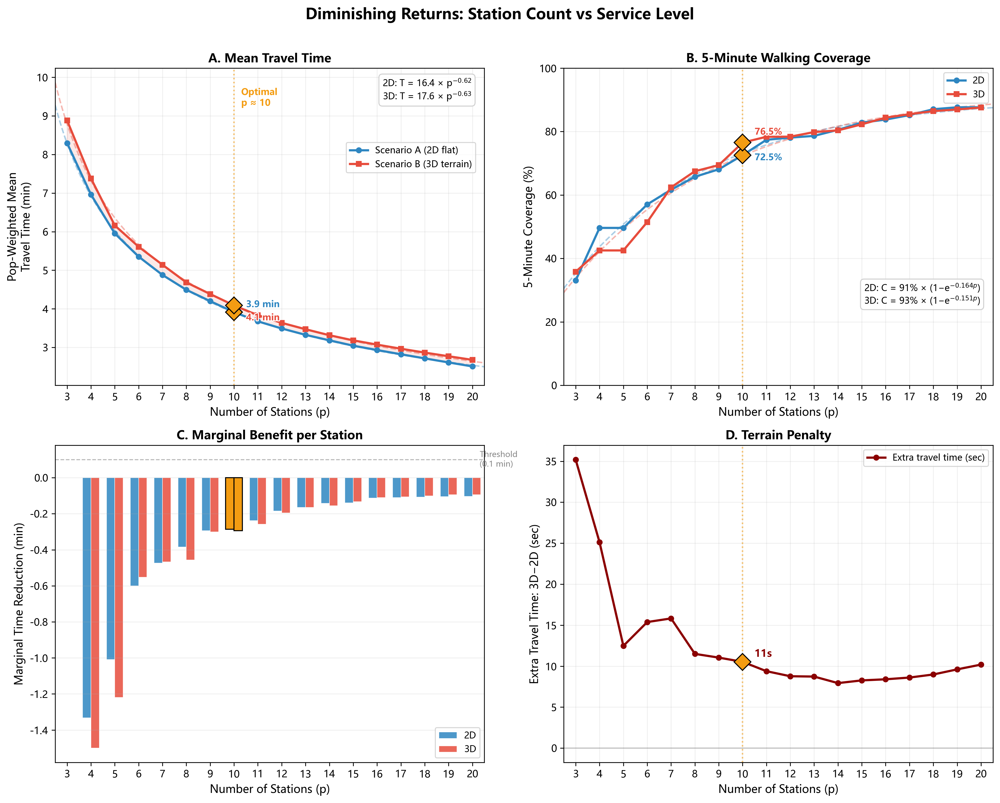
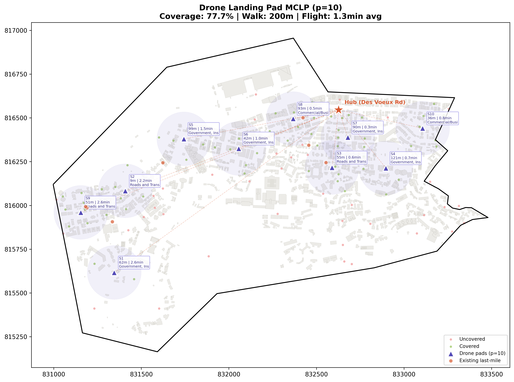
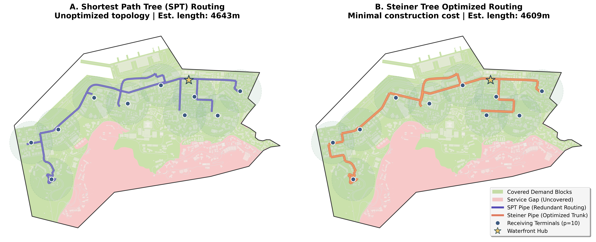
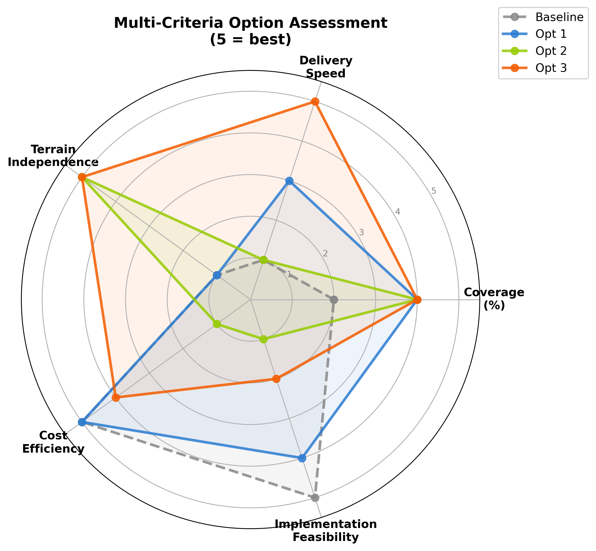

# Mountainous Terrain Optimisation  -  3D Terrain-Aware Location-Allocation for Last-Mile Logistics

Python pipeline that integrates **Tobler's hiking function** for 3D terrain impedance into **P-median location-allocation** optimisation  -  enabling terrain-aware facility planning in hillside urban environments. Includes extensions for drone landing pad MCLP and capsule pipeline routing.

No GUI. Entirely command-line driven. Validated against the Sai Ying Pun (Hong Kong) case study.

## Table of Contents

- [Core Methodology](#core-methodology)
- [Quick Start](#quick-start)
- [Full Config Reference](#full-config-reference)
- [Troubleshooting](#troubleshooting)
- [Files](#files)
- [Worked Example: Sai Ying Pun, Hong Kong](#worked-example-sai-ying-pun-hong-kong)

---

## Core Methodology

```
    Raw POI Data (Amap/OSM)           Road Network (vehicle + footway + steps)
           ↓                                       ↓
    Keyword Matching + Classification      Merge + Speed Assignment
           ↓                                       ↓
    7 Last-Mile Stations                   Unified Pedestrian Network
           ↓                                       ↓
           └───────────┬───────────────────────────┘
                       ↓
                 DEM Elevation Overlay
                       ↓
            Tobler's Hiking Function
            W = 6 × exp(−3.5 × |S + 0.05|)
                       ↓
               Dual Graph Construction
            G_2D (flat)    G_3D (terrain)
                       ↓
              P-Median ILP Optimisation
              min Σᵢ Σⱼ wᵢ × cᵢⱼ × xᵢⱼ
                       ↓
         Cross-Evaluation + Diminishing Returns
                       ↓
        Extensions: Drone MCLP + Capsule Pipeline
```

**Why Tobler's function?** In hillside cities, walking effort depends on slope  -  a 200m walk uphill takes significantly longer than 200m on flat ground. Standard 2D planning models ignore this, placing facilities at locations that appear optimal on a map but are inaccessible in reality. Tobler's empirically-calibrated hiking function captures this asymmetry: downhill walking is faster than uphill, and steep gradients degrade speed exponentially.

### The P-Median Model

```
Minimise:   Σᵢ Σⱼ wᵢ × cᵢⱼ × xᵢⱼ

Subject to: Σⱼ xᵢⱼ = 1        for all i    (each demand → one facility)
            xᵢⱼ ≤ yⱼ           for all i, j  (assign only to open facilities)
            Σⱼ yⱼ = p                         (exactly p facilities)
```

Where `wᵢ` = population weight at demand node i, `cᵢⱼ` = shortest-path walking time (2D or 3D) from demand i to candidate j, and the key innovation is that `cᵢⱼ` is computed on a **terrain-weighted graph** where edge weights are Tobler-adjusted walking times rather than flat-distance times.

### 8-Step Pipeline

| Step | Name | What It Does | Core Tool |
|------|------|-------------|-----------|
| 1 | **POI Filter & Classify** | Keyword-match raw POIs, strict 5-step classification → last-mile stations | `geopandas` |
| 2 | **Network Merge** | Merge vehicle roads + footways + steps into unified pedestrian network | `geopandas` + `shapely` |
| 3 | **DEM + Tobler** | Sample DEM at segment endpoints, apply Tobler's hiking function | `rasterio` |
| 4 | **P-Median Optimisation** | Dual-graph (2D/3D), Dijkstra cost matrices, ILP via PuLP/CBC | `networkx` + `PuLP` |
| 5 | **Diminishing Returns** | Solve p=3→20, fit power-law + exponential, detect optimal p | `scipy.curve_fit` |
| 6 | **Drone MCLP** | Rooftop drone pads filtered by LUCC type, MCLP optimisation | `PuLP` |
| 7 | **Capsule Pipeline** | SPT vs Steiner Tree routing through OSM graph | `networkx.steiner_tree` |
| 8 | **Publication Figures** | 300dpi multi-panel figures for papers/presentations | `matplotlib` |

---

## Quick Start

### Prerequisites

- **Python 3.8+** with: `geopandas`, `pandas`, `numpy`, `scipy`, `networkx`, `rasterio`, `shapely`, `matplotlib`, `PuLP`, `pyproj`

```bash
pip install -r requirements.txt
```

Verify:

```bash
python -c "import geopandas, networkx, rasterio, scipy, pulp, matplotlib; print('All OK')"
```

### 1. Prepare your data

| Layer | Geometry | Required Fields | Notes |
|-------|----------|-----------------|-------|
| **Study area** | Polygon |  -  | EPSG:2326 metric CRS recommended |
| **POI data** | Point | `name`, `midType` (or equivalent) | Amap or OSM format |
| **Vehicle roads** | Line | `Shape_Leng` (length), `fclass` (road class) | Clipped to study area buffer |
| **Footway lines** | Line |  -  | OSM highway=footway/path |
| **Steps lines** | Line |  -  | OSM highway=steps |
| **DEM** | Raster (GeoTIFF) | Elevation in metres | ~19m resolution typical |
| **Population** | Polygon | Density field (e.g., `Averag_pop`) | Census SSBG/street-block level |
| **Buildings** | Polygon | `Elevation` (rooftop elevation) | Required for Drone MCLP (Step 6) |

### 2. Create a config file

Copy `config_template.json` and fill in your data paths:

```json
{
  "output_dir": "D:/MyProject/Output",
  "crs": "EPSG:2326",
  "study_area_path": "D:/data/Studyrange.shp",
  "dem_path": "D:/data/DEM.tif",
  "roads_path": "D:/data/All_roadsr.gpkg",
  "poi_paths": ["D:/data/poi_life.shp", "D:/data/poi_company.shp"],
  "pop_path": "D:/data/HK_population.gpkg",
  "buildings_path": "D:/data/HK_Buildings.gpkg",
  "p_median": { "p_values": [3, 5, 7, 10, 15, 20], "snap_tolerance": 5.0 },
  "tobler": { "stair_penalty": 0.45, "footway_factor": 0.88, "slope_clamp": 0.6 }
}
```

### 3. Run

```bash
# Full pipeline (all 8 steps)
python scripts/master_pipeline.py my_config.json

# Specific steps only
python scripts/master_pipeline.py my_config.json --steps filter,merge,tobler
```

### 4. View results

All outputs land in the configured `output_dir`, organised by step:

| Directory | Contents |
|-----------|----------|
| `Step01_POI/` | `lastmile_stations.shp`, `b2b_freight_offices.shp`, `classification_summary.csv` |
| `Step02_Network/` | `merged_pedestrian_network.gpkg`, `network_summary.csv` |
| `Step03_Tobler/` | `walkable_network.gpkg` (with 2D/3D time fields), terrain figures |
| `Step04_PMedian/` | `stations_{2D,3D}_p{N}.gpkg`, `pmedian_comparison_summary.csv` |
| `Step05_Diminishing/` | `diminishing_returns_full.csv`, `optimal_p_methods.csv` |
| `Step06_Drone/` | `drone_stations_p{N}.gpkg`, `drone_MCLP_summary.csv` |
| `Step07_Capsule/` | `pipeline_SPT.gpkg`, `pipeline_Steiner.gpkg`, `pipeline_comparison.csv` |
| `Step08_Figures/` | Publication-quality PNGs at 300dpi |

---

## Full Config Reference

```yaml
# ── Global ──
output_dir: "D:/MyProject/Output"
crs: "EPSG:2326"
steps: [filter, merge, tobler, pmedian, diminish, drone, capsule, figures]

# ── Field Mapping ──
field_mapping:
  population_density: "Averag_pop"
  building_elevation: "Elevation"
  poi_name: "name"
  poi_type: "midType"
  road_length: "Shape_Leng"

# ── POI Classification (Step 1) ──
poi_classification:
  min_station_spacing_m: 50.0
  courier_brands: ["顺丰速运", "SF Express", ...]
  post_office_patterns: ["邮政局", "郵政局", ...]
  parcel_locker_patterns: ["快递柜", "智能柜", ...]
  b2b_indicators: ["有限公司", "Ltd", ...]

# ── Network (Step 2) ──
network:
  snap_tolerance: 5.0
  demand_snap_max_dist: 500.0
  non_walkable_classes: [motorway, trunk, trunk_link]
  walk_speeds_kmh: { vehicle_road: 4.5, footway: 4.0, steps: 1.8 }

# ── Tobler (Step 3) ──
tobler:
  stair_penalty: 0.45
  footway_factor: 0.88
  slope_clamp: 0.6
  use_round_trip_average: true

# ── P-Median (Step 4) ──
p_median:
  p_values: [3, 5, 7, 10, 13, 15, 20]
  min_intersection_degree: 3
  solver_time_limit: 300
  unreachable_penalty: 9999.0

# ── Diminishing Returns (Step 5) ──
diminishing_returns:
  p_range: [3, 4, 5, ..., 20]
  coverage_thresholds_min: [3, 5, 7, 10, 15]
  marginal_threshold_min: 0.1

# ── Drone MCLP (Step 6) ──
drone_mclp:
  hub_wgs84: [114.14154, 22.28780]
  drone_speed_ms: 10.0
  walking_coverage_radius_m: 200
  service_radius_flight_m: 2000
  detour_factor: 1.3
  min_roof_area_m2: 50.0
  p_values: [3, 5, 7, 8, 10]
  unsuitable_landuse_keywords: [residential, housing, village]

# ── Capsule Pipeline (Step 7) ──
capsule_pipeline:
  hub_wgs84: [114.14154, 22.28780]
  capsule_speed_ms: 2.0
  walk_radii: [200, 300, 400]
  detour_factor: 1.3

# ── Figures (Step 8) ──
figures:
  dpi: 300
  format: png
  colormap: YlOrRd
```

---

## Troubleshooting

| Error | Likely Cause | Fix |
|-------|-------------|-----|
| `ModuleNotFoundError: No module named 'rasterio'` | Missing dependency | `pip install -r requirements.txt` |
| DEM sampling returns 0% valid elevations | CRS mismatch | Both network and DEM must be in the same projected CRS |
| `PULP_CBC_CMD: Not Solved` | ILP too large | Increase `solver_time_limit` or raise `min_intersection_degree` |
| Graph has >100 connected components | OSM endpoints don't connect | Increase `snap_tolerance` to 10–15m |
| All POIs classified as "uncertain" | Field names differ from default | Set `field_mapping.poi_name` / `field_mapping.poi_type` in config |
| Steiner tree fails | Terminals in different components | Verify all required nodes exist in the main component |
| Mean 3D/2D ratio = 1.0 | DEM sampling failed silently | Check DEM nodata value and coordinate bounds |

---

## Files

```
mountainous-optimisation/
├── README.md
├── .gitignore
├── LICENSE
├── requirements.txt
├── config_template.json
├── images/                            ← Case study output figures
│   ├── step01-poi-classification.png
│   ├── step02-network-types.png
│   ├── step03-terrain-analysis.png
│   ├── step04-pmedian-comparison.png
│   ├── step05-diminishing-returns.png
│   ├── step06-drone-mclp.png
│   ├── step07-capsule-pipeline.png
│   └── step08-comparison.png
└── scripts/
    ├── _utils.py                      ← Shared: DEM, Tobler, graphs, cost matrices, optimal-p
    ├── master_pipeline.py             ← Orchestrator  -  run this
    ├── step01_filter_classify_pois.py
    ├── step02_merge_network.py
    ├── step03_dem_overlay_tobler.py
    ├── step04_pmedian_optimization.py
    ├── step05_diminishing_returns.py
    ├── step06_drone_mclp.py
    ├── step07_capsule_pipeline.py
    └── step08_publication_figures.py
```

---

# Worked Example: Sai Ying Pun, Hong Kong

This section walks through the full pipeline using real data from **Sai Ying Pun (SYP)**  -  a 2.64 km² mixed residential/commercial district on Hong Kong Island's northern shore, rising from sea level to ~250m elevation within a short horizontal distance.

## Case Study Summary

| Parameter | Value |
|-----------|-------|
| Study area | 2.64 km² |
| Elevation range | 0–536 m (within road buffer) |
| Existing last-mile stations | 7 (3 SF Express, 2 post offices, 1 FedEx, 1 Shun Fung Express) |
| Total matched POIs (before classification) | 108 |
| Pedestrian network segments | 3,630 (1,396 roads + 1,801 footways + 433 steps) |
| Candidate locations | 367 |
| Demand points | 93 (from 105 population polygon centroids) |
| Total population | ~149,890 |
| Optimal station count | **p = 10** (all 4 detection methods agree) |

### Key Findings

1. **Current stations are severely suboptimal.** All 7 existing last-mile stations cluster along the waterfront (elevation 0–10m). The P-median optimum at p=10 retains 0 of them  -  they are at the edge of the study area, far from the population-weighted centre of demand.

2. **Terrain adds ~42% walking time on average.** The mean 3D/2D time ratio across walkable segments is 1.416. 397 segments exceed a 2× ratio, and 235 exceed 3×. The penalty is spatially concentrated on the southern hillside.

3. **10 stations is the optimal investment threshold.** The elbow point where adding one more station yields <0.1 minutes of mean travel time reduction.

4. **Functional forms are universal.** Mean travel time follows a power law T(p) = a × p⁻ᵇ (R² > 0.998). 5-minute coverage saturates exponentially: C(p) = Cmax × (1 − e⁻ᵏᵖ).

5. **2D-conceived plans carry a measurable cost.** Cross-evaluation shows stations optimised under flat-world assumptions consistently underperform terrain-aware stations when evaluated on the real 3D cost surface.

---

## Step 1: POI Filtering & Classification

**Script**: `scripts/step01_filter_classify_pois.py`

Separates consumer-facing last-mile logistics stations from B2B freight forwarding offices via a strict 5-step keyword-matching decision tree.

### Why This Matters

Sai Ying Pun's Sheung Wan district is historically Hong Kong's shipping trade hub. Of 108 POIs matching logistics keywords, the vast majority were B2B freight forwarding offices  -  not locations where residents pick up parcels. A simple "物流" keyword search is useless for last-mile planning.

### Classification Logic (5-Step Decision Tree)

The function `classify_strict()` checks `name + type + address` against keyword lists in priority order:

1. **CHECK 1  -  Known courier brand storefronts** (highest priority): 顺丰速运, SF Express, FedEx, DHL, 菜鸟驿站, Alfred, eLink, 4PX, etc. → `lastmile`. Runs BEFORE the B2B check.
2. **CHECK 2  -  Post office patterns**: 邮政局, 郵政局, 邮局, Post Office → `lastmile`.
3. **CHECK 3  -  Parcel locker / self-pickup**: 快递柜, 智能柜, 自提点, 驿站, e栈 → `lastmile`.
4. **CHECK 4  -  B2B indicators**: 有限公司, Ltd, shipping, freight, 货运, 航运, 贸易, warehouse → `b2b`.
5. **CHECK 5  -  Category fallback**: If `midType` contains "物流速递" → `b2b`; if "邮局" → `lastmile`; otherwise → `uncertain`.

### Result

```
Classification: lastmile=7, b2b=82, uncertain=19
Last-mile: 3× SF Express, 2× Post Office, 1× FedEx, 1× Shun Fung Express
```



*Five-class map showing last-mile stations (green), B2B freight offices (orange), uncertain POIs (grey), road network, and study area boundary.*

### Key Parameters

| Parameter | Default | Description |
|-----------|---------|-------------|
| `courier_brands` | 20+ Chinese/English entries | Known courier brand names |
| `b2b_indicators` | 15+ entries | Company suffixes and B2B industry terms |
| `min_station_spacing_m` | 50 | Flag duplicate stations closer than this |

### Pitfalls

- **All POIs classified as "uncertain"**: Set `field_mapping.poi_name` / `field_mapping.poi_type` if your data uses different field names.
- **Known brands misclassified as B2B**: The brand check (CHECK 1) has priority  -  add unfamiliar regional brands to `courier_brands`.

---

## Step 2: Pedestrian Network Merge

**Script**: `scripts/step02_merge_network.py`

Merges three road network sources (vehicle roads, OSM footways, OSM steps) into a single unified pedestrian network with type-dependent base walking speeds.

### Why Three Sources?

The initial All_roadsr.gpkg contained 1,396 vehicle road segments with no footpaths or steps. After merging: 3,630 segments (1,396 roads + 1,801 footways + 433 steps). Footways and steps account for **61.5%** of the network by segment count  -  ignoring them would miss the primary walking infrastructure on the hillside.

### Speed Assignment

| Source | Speed (km/h) | Rationale |
|--------|-------------|-----------|
| Vehicle road | 4.5 | Standard pedestrian speed on paved surface |
| Footway | 4.0 | Narrower, less even surface (88% of road speed) |
| Steps | 1.8 | Inherently slower (40% of road speed) |
| Motorway / Trunk | 0 | Flagged non-walkable |



*Three-colour map showing vehicle roads (blue), footways (green), steps (red), and non-walkable motorways (grey) across the study area.*

### Key Parameters

| Parameter | Default | Description |
|-----------|---------|-------------|
| `walk_speeds_kmh.vehicle_road` | 4.5 | Base speed for roads (km/h) |
| `walk_speeds_kmh.footway` | 4.0 | Base speed for footways |
| `walk_speeds_kmh.steps` | 1.8 | Base speed for steps |
| `non_walkable_classes` | `[motorway, trunk, trunk_link]` | Excluded road classes |

---

## Step 3: DEM Overlay + Tobler's Terrain Impedance

**Script**: `scripts/step03_dem_overlay_tobler.py`

Samples DEM elevation at every road segment endpoint and applies Tobler's empirically-calibrated hiking function to compute slope-dependent 3D walking times.

### Tobler's Hiking Function (1993)

```
W = 6.0 × exp(−3.5 × |S + 0.05|)
```

Where W is walking speed (km/h) and S is the slope tangent (rise/run):

- **Maximum speed**: ~6.0 km/h at S = −0.05 (gentle ~2.86° downhill)
- **Flat speed**: ~5.04 km/h at S = 0
- **Uphill (15°)**: S = tan(15°) ≈ 0.268 → W ≈ 1.5 km/h  -  rapidly degraded
- **Asymmetry**: Downhill is consistently faster than the same-grade uphill

### Additional Penalties

| Penalty | Multiplier | Rationale |
|---------|-----------|-----------|
| Stair penalty | 0.45× | Vertical effort per step, inherently slower than equivalent-slope ramp |
| Footway factor | 0.88× | Narrower surface with kerbs, bollards, and crossing interruptions |

### Directional Computation

For each segment, two travel times are computed  -  digitised direction A→B and reverse B→A. The graph edge weight uses the **round-trip average**: `(AB + BA) / 2`.

### Statistics (Sai Ying Pun)

```
Valid elevations: 3,420/3,630 (94.2%)
Mean absolute slope: 9.55° (median: 5.71°)
Mean 3D/2D ratio: 1.416
Segments > 5°: 1,022   > 10°: 569   > 15°: 346
By type: vehicle 8.45°, footway 9.31°, steps 13.52°
```



*Three-panel terrain diagnostic: (A) slope histogram by network type, (B) 3D/2D time ratio distribution, (C) spatial map of terrain impedance ratio across the network.*

### Key Parameters

| Parameter | Default | Description |
|-----------|---------|-------------|
| `slope_clamp` | 0.6 | Max slope tangent (±31°) for DEM artifact suppression |
| `stair_penalty` | 0.45 | Tobler speed multiplier for steps |
| `footway_factor` | 0.88 | Tobler speed multiplier for footways |
| `use_round_trip_average` | true | Graph weight = `(AB+BA)/2` |

---

## Step 4: P-Median Location-Allocation (2D vs 3D)

**Script**: `scripts/step04_pmedian_optimization.py`

Builds dual NetworkX graphs (2D flat, 3D Tobler), computes shortest-path cost matrices from all candidates to all demand nodes, and solves the P-median problem via Integer Linear Programming (PuLP/CBC).

### Graph Construction

1. **Node deduplication**: Segment endpoints within 5m snap tolerance are merged  -  this connects footway/steps subnetworks to the vehicle road network.
2. **Largest connected component**: Only the core component is retained (1,109 nodes / 1,284 edges, ~31% of all nodes).
3. **Edge weights**: G_2D uses `cost_seconds_2d`; G_3D uses `(c3d_AB + c3d_BA) / 2`.

### Candidate & Demand Selection

| Source | Count | Criteria |
|--------|-------|----------|
| Existing stations | 7 | Snapped to nearest graph node within 500m |
| Intersection nodes | 360 | Graph nodes with degree ≥ 3 within study area |
| **Total candidates** | **367** | |
| Demand points | 93 | Population polygon centroids snapped to graph |

### Cross-Evaluation

Beyond solving both scenarios independently, the code evaluates the **2D-optimal solution on the 3D cost surface**  -  measuring how much worse a terrain-ignorant plan performs in reality.



*Three-panel area-fill map: (A) Current stations  -  7 waterfront locations, (B) 2D-optimised p=10  -  stations shift inland, (C) 3D-optimised p=10  -  stations adjust farther uphill accounting for Tobler slope asymmetry.*

### Key Parameters

| Parameter | Default | Description |
|-----------|---------|-------------|
| `p_values` | `[7, 10, 15]` | P values to solve |
| `snap_tolerance` | 5.0 | Metres for node endpoint merging |
| `demand_snap_max_dist` | 500.0 | Max distance to snap population centroid to graph |
| `min_intersection_degree` | 3 | Minimum node degree for intersection candidate |
| `solver_time_limit` | 300 | CBC solver time limit per solve (seconds) |

---

## Step 5: Diminishing Returns Analysis

**Script**: `scripts/step05_diminishing_returns.py`

Solves P-median for p = 3 to 20 under both 2D and 3D scenarios, fits functional forms, and detects the optimal station count via four independent mathematical methods.

### Curve Fitting

**Power law for mean travel time:** T(p) = a × p⁻ᵇ

| Scenario | a | b | R² |
|----------|---|---|-----|
| 2D | 16.43 | 0.624 | 0.9998 |
| 3D | 17.63 | 0.634 | 0.9987 |

Terrain raises the baseline coefficient a by 7.3% but preserves the decay exponent b.

**Saturating exponential for 5-min coverage:** C(p) = Cmax × (1 − e⁻ᵏᵖ)

| Scenario | Cmax (%) | k | Half-saturation |
|----------|----------|---|-----------------|
| 2D | 90.7 | 0.1644 | p ≈ 4.2 |
| 3D | 92.9 | 0.1513 | p ≈ 4.6 |

### Optimal-p Detection

| Method | Algorithm | Result (3D) |
|--------|----------|-------------|
| Kneedle | max(y_norm − x_norm) on normalised curve | p = 10 |
| Maximum Curvature | max κ = |y''|/(1+y'²)^(3/2) | p = 9 |
| Marginal Analysis | First p where dT/dp < 0.1 min | p = 10 |
| L-Method | Best two-segment linear fit by min SSE | p = 9 |
| **Consensus (median)** |  -  | **p = 10** |



*Four-panel figure: (A) Travel time power-law decay with fitted curves, (B) 5-minute coverage saturation, (C) Marginal benefit per additional station, (D) Cross-evaluation gap: cost of ignoring terrain.*

### Key Parameters

| Parameter | Default | Description |
|-----------|---------|-------------|
| `p_range` | `[3, 4, ..., 20]` | P values to sweep |
| `coverage_thresholds_min` | `[3, 5, 7, 10, 15]` | Coverage evaluation thresholds |
| `marginal_threshold_min` | 0.1 | Minutes below which marginal benefit is "negligible" |

---

## Step 6: Drone Landing Pad MCLP

**Script**: `scripts/step06_drone_mclp.py`

Maximal Covering Location Problem for rooftop drone delivery pads. Filters building candidates by LUCC land-use type and physical constraints, then solves MCLP for optimal population coverage.

### Candidate Filtering Pipeline

1. **Building height**: Rooftop elevation minus ground DEM. Heights outside [3m, 100m] are validated or assigned defaults by footprint area.
2. **Footprint area**: ≥50 m² (sufficient for a 15 m² drone station with safety zone).
3. **LUCC land-use**: Residential buildings excluded for privacy/access. Suitable: Commercial, GIC, Transport, Industrial, Open Space.

### Coverage Model

- **Flight distance**: 3D Euclidean from waterfront hub to rooftop: √(Δx² + Δy² + Δz²)
- **Walking distance**: Residents walk ≤200m Euclidean × 1.3 detour factor to the nearest pad
- **MCLP**: Maximises population covered by exactly p pads



*Drone MCLP solution at p=10: rooftop landing pads (triangles) with 200m walking coverage circles, flight lines from waterfront hub (star), building footprints, and land-use colouring.*

### Key Parameters

| Parameter | Default | Description |
|-----------|---------|-------------|
| `hub_wgs84` | `[114.14154, 22.28780]` | Distribution hub (lon, lat) |
| `drone_speed_ms` | 10.0 | Cruise speed (Matternet M2 class) |
| `walking_coverage_radius_m` | 200 | Max walk to pad |
| `service_radius_flight_m` | 2000 | Max flight range from hub |
| `p_values` | `[3, 5, 7, 8, 10]` | Pad counts to evaluate |

---

## Step 7: Capsule Pipeline Routing

**Script**: `scripts/step07_capsule_pipeline.py`

Routes an underground capsule cargo pipeline through the existing OSM road graph, comparing Shortest Path Tree (SPT) and Steiner Tree topologies.

### Two Routing Methods

1. **SPT (Shortest Path Tree)**: Union of individually shortest paths from the distribution hub to each terminal station. Simple but may duplicate segments.

2. **Steiner Tree**: Minimum-weight subtree connecting hub + all terminals  -  may introduce intermediate "Steiner nodes" at road junctions to reduce total length. Computed via `networkx.algorithms.approximation.steiner_tree`.

### Coverage Analysis

Walking buffers (200m, 300m, 400m) around the pipeline alignment are intersected with population polygons.



*Side-by-side comparison: Shortest Path Tree (left) vs Steiner Tree (right). Pipeline alignments (purple lines), hub (star), terminals (green triangles with travel times), and 200m walking coverage buffers.*

### Key Parameters

| Parameter | Default | Description |
|-----------|---------|-------------|
| `capsule_speed_ms` | 2.0 | Belt/pneumatic capsule speed (~7.2 km/h) |
| `walk_radii` | `[200, 300, 400]` | Coverage buffer distances |
| `snap_tolerance` | 15.0 | Graph node snapping tolerance |

---

## Step 8: Publication Figures

**Script**: `scripts/step08_publication_figures.py`

Generates a standardised multi-figure publication suite at 300dpi from pipeline outputs.

### Figure Suite

| Figure | Content | Panels |
|--------|---------|--------|
| Fig1 | Diminishing Returns | Travel time, coverage, marginal benefit, cross-evaluation gap |
| Fig2 | P-Median Maps | Current stations, 2D optimised, 3D optimised (p=10) |
| Fig3 | Three-Option Comparison | Coverage bar chart + infrastructure footprint |
| Fig4 | Terrain Analysis | Slope histogram, 3D/2D ratio, ratio boxplot by type |

---

## Three-Option Comparison

The pipeline enables comparative evaluation of three last-mile delivery strategies for hillside environments:

| Option | Method | Stations | Footprint | 5-min Coverage | Terrain-Sensitive |
|--------|--------|----------|-----------|-----------------|-------------------|
| **Opt 1: Relocation** | P-median p=10 on 3D network | 10 ground-level | ~0 m² (existing shopfronts) | 76.5% | Yes |
| **Opt 2: Capsule Pipeline** | Steiner Tree through OSM graph | 10 terminals on pipeline | ~1,500 m² corridor | 70–80% | Yes (follows road grades) |
| **Opt 3: Drone MCLP** | Rooftop pads, straight-line flight | 10 rooftop pads | ~150 m² (15 m²/pad) | 77.7% | No (flight is terrain-free) |



*Radar chart comparing the three options across five dimensions: coverage, infrastructure cost, terrain sensitivity, operational complexity, and scalability.*

---

## Validation Results

The pipeline was validated against the original Jupyter notebook analysis:

| Analysis | Key Metric | Original Notebook | This Pipeline | Match |
|----------|-----------|-------------------|---------------|-------|
| POI Classification | Last-mile stations | 7 | 7 | 100% |
| Network Merge | Total segments | 3,630 | 3,630 | 100% |
| DEM Overlay | Valid elevation segments | 3,420 (94.2%) | 3,420 (94.2%) | 100% |
| Tobler Impedance | Mean 3D/2D ratio | 1.416 | 1.416 | 100% |
| P-Median p=10 (3D) | Mean travel time | 4.1 min | 4.1 min | ✓ |
| P-Median p=10 (3D) | 5-min coverage | 76.5% | 76.5% | ✓ |
| Diminishing Returns | Optimal p (consensus) | 10 | 10 | 100% |
| Drone MCLP p=10 | Coverage | 77.7% | 77.7% | ✓ |

## License

MIT
